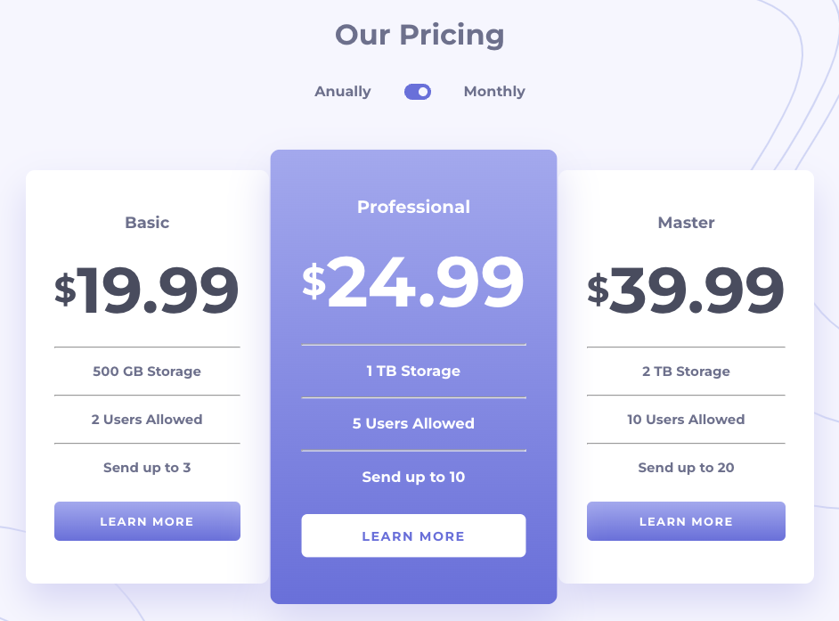
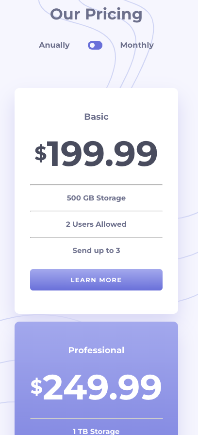

# Frontend Mentor - Pricing component with toggle

## Welcome! 👋

This is a solution to the [Pricing component with toggle challenge on Frontend Mentor](https://www.frontendmentor.io/challenges/pricing-component-with-toggle-8vPwRMIC).

### Screenshot

### Links

- Solution URL: [Github code repo](https://github.com/lastiwan89/fem-pricing-component-toggle)
- Live Site URL: [Netlify](https://64d084310ad72939c1b83f54--sparkly-naiad-fb34a2.netlify.app/)

## My process

- because of this page have toggle and also data change. i like to use react with state

### Built with

- Vite + React Setup
- React Sass
- React icon
- Flexbox and grid combination

### Continued development

please leave review and comment in this project

## Author

- Frontend Mentor - [@lastiwan89](https://www.frontendmentor.io/profile/lastiwan89)

**Have fun building!** 🚀
